<!-- Scoped style -->
<style scoped>
p {
  color: black;
  text-align:center
}
</style>

# The Story of Behavior Driven Development


## Why we need to behaviors 

Volkan Özdamar - QA Specialist

@TrendyolTech

<!-- _footer :  -->


---
<!-- Scoped style -->
<style scoped>
h1 {
  color: black;
  text-align:center;
  background-color:white
}
</style>


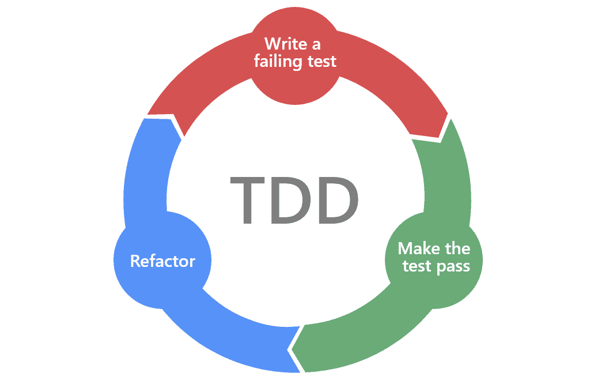
# TDD promotes a test-then-code approach


---

### BDD was born to solve to triple conundurm of TDD

- Programmers didn’t want to write tests
- Testers didn’t want programmers writing tests
- Business stakeholders didn’t see any value in anything that wasn’t production code.

---

### in March 2006 , Dan North published an article in Better Software magazine

    https://www.stickyminds.com/better-software-magazine/behavior-modification


---

My response is behavior-driven development (BDD). It has evolved out of established agile practices and is designed to make them more accessible and effective for teams new to agile software delivery.

-Dan North

---
# Test method names should be sentences


```java
public class CustomerLookupTest extends TestCase {
testFindsCustomerById() {
...
}
testFailsForDuplicateCustomers() {
...
}
...
}
```
CustomerLookup
- finds customer by id
- fails for duplicate customers
- ...

---

# A simple sentence template keeps test methods focused (The class should do something)

```
public class ClientDetailsValidator {
 
private final AgeCalculator ageCalc;
 
public ClientDetailsValidator(AgeCalculator ageCalc) {
this.ageCalc = ageCalc;
}
}
```
I started writing a **ClientDetailsValidatorTest** with methods like 
**testShouldFailForMissingSurname** and **testShouldFailForMissingTitle**.

---

## An expressive test name is helpful when a test fails

After a while, I found that if I was changing code and caused a test to fail, I could look at the test method name and identify the intended behaviour of the code. Typically one of three things had happened:

* I had introduced a bug. Bad me. Solution: Fix the bug.
* The intended behaviour was still relevant but had moved elsewhere. Solution: Move the test and maybe change it.
* The behaviour was no longer correct – the premise of the system had changed. Solution: Delete the test.

---

A more subtle aspect of the word should becomes apparent when compared with the more formal alternatives of **will or shall.** Should implicitly allows you to challenge the premise of the test: **“Should it? Really?”** This makes it easier to decide whether a test is failing due to a bug you have introduced or simply because your previous assumptions about the system’s behaviour are now incorrect.

---

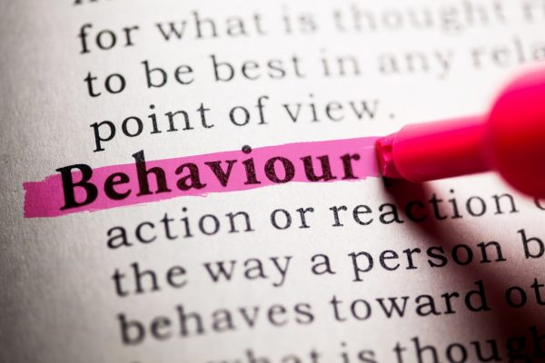

---
# "Behaviour" is a more useful word than "test"

I started using the word **"behaviour"** in place of **"test"** in my dealings with TDD and found that not only did it seem to fit but also that a whole category of coaching questions magically dissolved. I now had answers to some of those TDD questions. 

---
<style scoped>
table {
  margin-left:20%
}
h1 {
  color: black;
  text-align:center;
  background-color:white
}
</style>
# A BDD Phrasebook for TDDers:

| TDD           | BDD             |   
| ------------- |:---------------:| 
| Test          | Behavior        | 
| Test Method   | Behavior Method |   
| TestCase      | Behavior Class  |
| TestSuite     | Behaviors       |
| Unit Test     | Behavior Method |
| Assert        | Mock            |
| Acceptance Test/Function Test        | Scenario            |  

---

Working with business analyst colleague Chris Matts, North set out to apply what he had learned to the requirements-analysis space.Around this time, **Eric Evans** introduced the idea of **Domain-Driven Design**,  which promotes the use of a ubiquitous language that business people can understand to describe and model a system. North and Matts’s vision was to create a ubiquitous language that business analysts could use to define requirements unambiguously, and that could also be easily transformed into automated acceptance tests. To implement this vision, they started expressing the acceptance criteria for user stories in the form of loosely structured examples, known as “scenarios,”
 Eric Evans, Domain Driven Design (Addison-Wesley Professional, 2003).

---

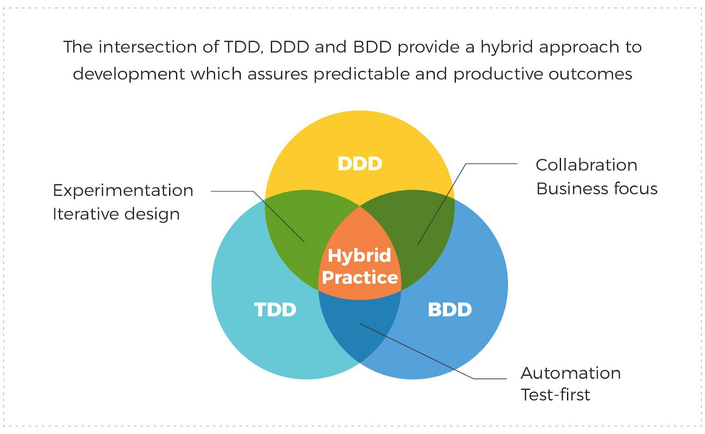

---
 # Gherkin and JBehave

 **Gherkin** is a Business Readable, Domain Specific Language created specifically for behavior descriptions. It gives you the ability to remove logic details from behavior tests.

 Dan North wrote the first dedicated BDD test automation library, **JBehave**, in the mid-2000s

---


---

A **feature** is a tangible, deliverable piece of functionality that helps the business to achieve its business goals.

The natural order of a scenario is Given ... When ... Then : 
* **Given** describes the preconditions for the scenario and prepares the test environment. 
* **When** describes the action under test. 
* **Then** describes the expected outcomes.
  
The **And** and **But** keywords can be used to join several

---
```
Feature: Product basket
  In order to buy products
  As a customer
  I need to be able to put interesting products into a basket

  Rules:
  - VAT is 20%
  - Delivery for basket under £10 is £3
  - Delivery for basket over £10 is £2

  Scenario: Buying a single product under £10
    Given there is a "Sith Lord Lightsaber", which costs £5
    When I add the "Sith Lord Lightsaber" to the basket
    Then I should have 1 product in the basket
    And the overall basket price should be £9
```

---

```
Scenario outline: Expect security updates to be installed
   Given the server is Ubuntu 14.04
   And the package <package>
   When the version is fetched
   Then It should be equal or later than version <version>

   Examples: Ubuntu 14.04 nginx packages with security updates
     | package      | version          |
     | nginx        | 1.4.6‑1ubuntu3.7 |
     | nginx‑common | 1.4.6‑1ubuntu3.7 |
     | nginx‑core   | 1.4.6‑1ubuntu3.7 |
```


---


---


---

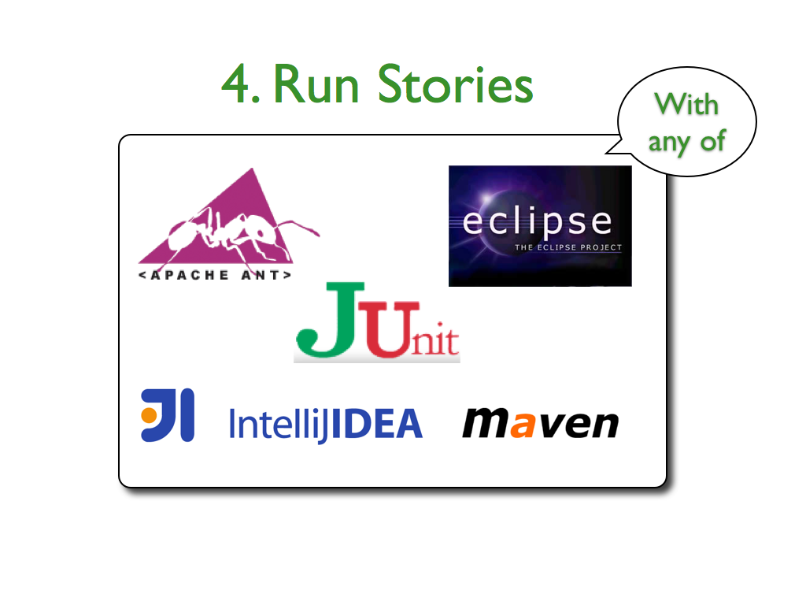

---

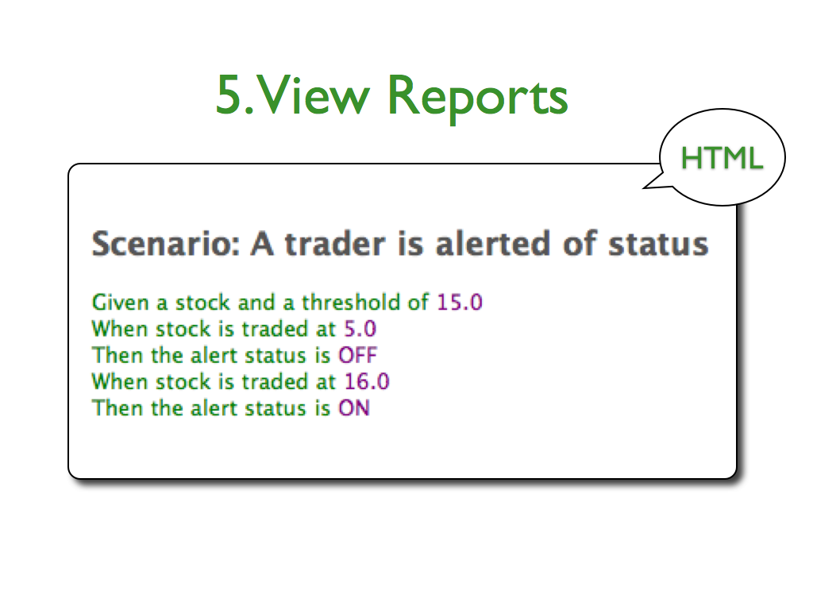

---

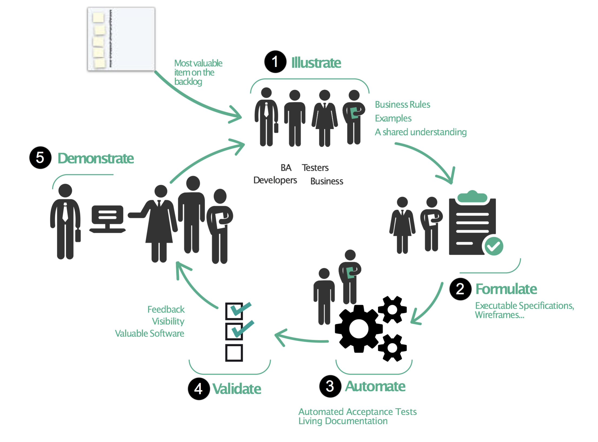

---

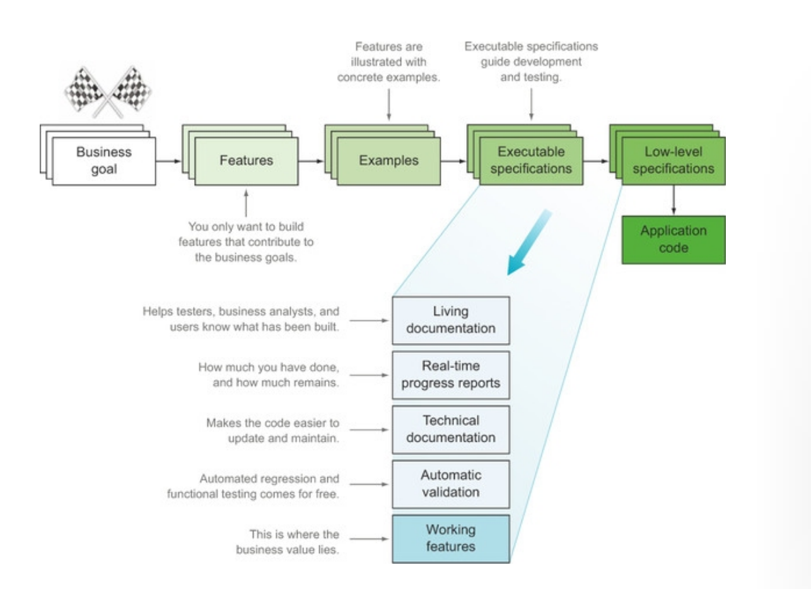

---

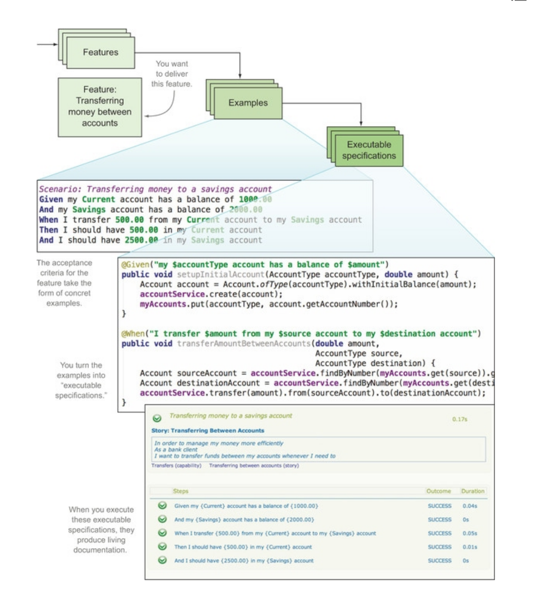

---

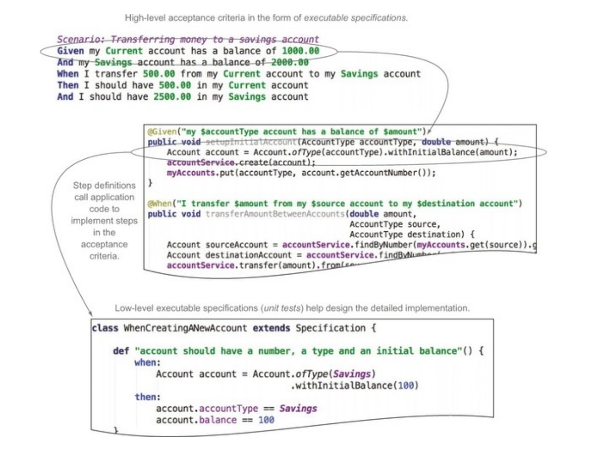

---

# Benefits of BDD

* Reduced wastetime
* Reduced cost
* Easier and safer changes
* Faster Releases

---

# Disadvantages and potential challenges of BDD

 * BDD requires high business engagement and collaboration
 * BDD works best in an Agile or iterative context
 * BDD doesn’t work well in a silo
 * Poorly written tests can lead to higher test-maintenance costs

---

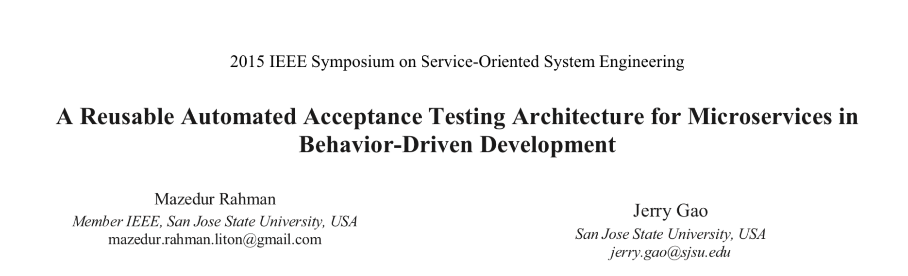

https://ieeexplore.ieee.org/document/7133548

---
<style scoped>
img {
  margin-left:20%
}
</style>

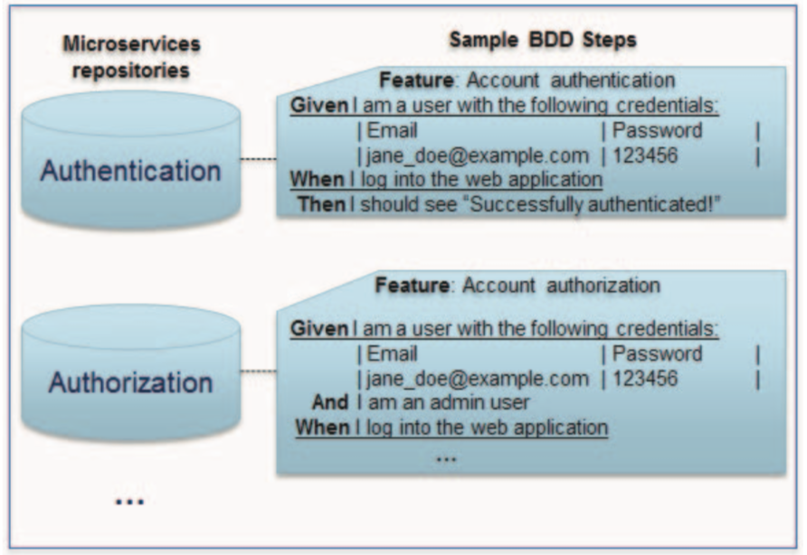 

---

# Reusability of step implementations for BDD
 As a software developer/tester, I want to reuse the implementation of common steps for BDD scenarios used by multiple microservices, so that I can avoid duplicate code for each implementation in multiple codebases for those services. For example if a BDD step **“I am a user with the following credentials”** is used by two microservices  – **“Account Authentication Service”** and **“Account Authorization Service”**, then the implementation for this step should be reusable for both services.

 ---

 # Ease of auditability
 
  As a product owner/stakeholder/business analyst, I want to keep acceptance tests in a common repository, so that I can easily be able to audit the capability of my application built on microservices architecture. Often a microservices architecture based application is composed of many microservices. If a lot of BDD features/scenarios are spread across large number of microservices repositories, it becomes difficult for the product owners/stakeholders/business analysts to know the capability of the application as a whole.

 ---

 # Challenges


* Maintainability
   * BDD framework version upgrade
   * Refactoring
   * Systems integration complexity during runtime
   * Black-box testing using production-like execution environment
        While TDD encourages writing unit tests in **isolation** with the help of mocks, stubs, fakes, etc., BDD encourages writing end-to-end acceptance tests reflecting **business behavior with real life execution** environment during development phase. Emulating production-like execution environment during development and testing can be daunting considering complex need such as scalability, fault tolerance, logging, monitoring, and so on.

---

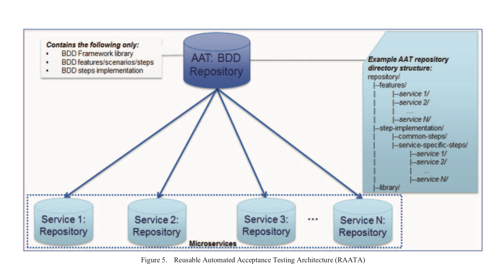 

---

**features:** This directory contains one subdirectory for each microservice. If an application consists of N microservices, then there will be N subdirectories starting from service 1 through service N. Each microservice subdirectory contains all the feature files with BDD scenarios necessary for that service. Organizing all the features of an application this way allows easy auditing of the capabilities of the application.

---

**step-implementation:** This directory contains implementations for the BDD steps recorded in the subdirectory under features directory. The implementations for the common steps across two or more microservices for the application are placed under a subdirectory called “common-steps” and service specific steps are placed under subdirectories named after each microservice. Implementing BDD steps this way with the AAT repository helps to avoid duplicate code for the same step. This also allows easy refactoring of the step implementation as each step has only one implementation, and hence only one place to refactor the implementation.

---

**library:** This directory contains the source code for the selected BDD framework. Since the same framework is applied to all microservices, upgrading the version of the framework becomes a very easy and trivial task.

---

# References

  * BDD in Action ; John Ferguson Smart (https://www.manning.com/books/bdd-in-action)
  * A Reusable Automated Acceptance Testing Architecture for Microservices in Behavior-Driven Development; Mazedur Rahman , Jerry Gao (https://ieeexplore.ieee.org/document/7133548)
  * A Behavior Driven Developer’s guide to Infrastructure as Code , Aaron Cohen (https://developer.ibm.com/tutorials/d-bbd-guide-iac/)
  * https://docs.behat.org
  * https://jbehave.org/

---

# Thanks!

mail me : volkan@volkanozdamar.com