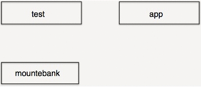
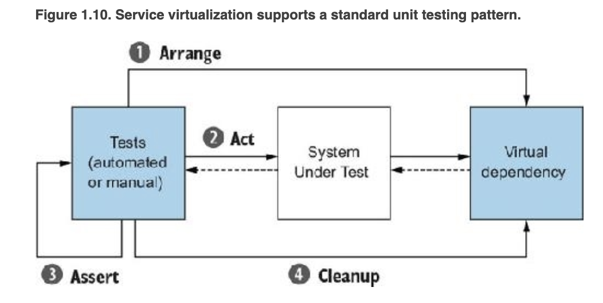
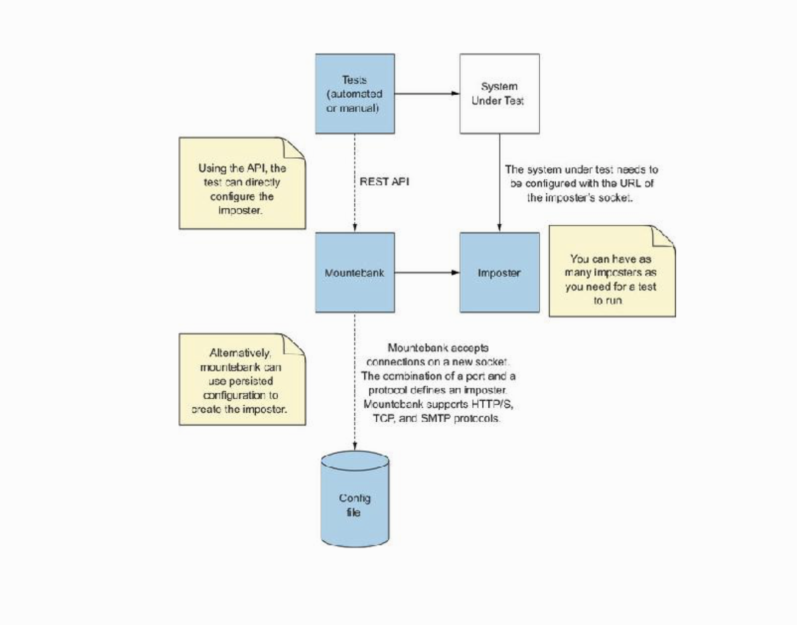
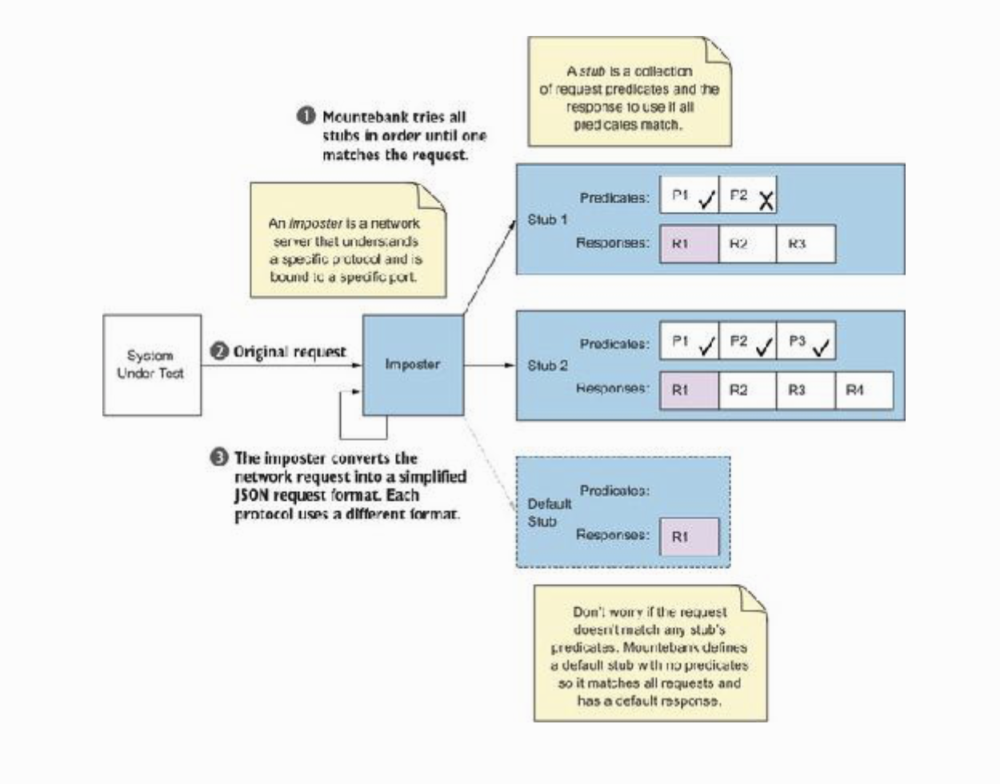

# Mocking with Mountebank and Javabank

Volkan Özdamar

---

**mountebank** is the first open source tool to provide cross-platform, multi-protocol test doubles over the wire. Simply point your application under test to mountebank instead of the real dependency, and test like you would with traditional stubs and mocks.



---


| builtin protocols  | community plugins  | 
|:-:|:-:|
| http |  ldap |
| https | grpc  |
| tcp | websockets  |
| smtp |   |


---

**docker pull bbyars/mountebank**

**docker run --rm -p 2525:2525 -p 8080:8080 mountebank:2.3.0 mb start --configfile imposters.ejs**

or 

**npm install -g mountebank**

---
```
<dependency>
    <groupId>org.mbtest.javabank</groupId>
    <artifactId>javabank-core</artifactId>
    <version>0.4.10</version>
</dependency>
```
```
<dependency>
    <groupId>org.mbtest.javabank</groupId>
    <artifactId>javabank-client</artifactId>
    <version>0.4.10</version>
</dependency>
```

---



---



---

**imposter**
A server representing a test double. An imposter is identified by a port and a protocol. mountebank is non-modal and can create as many imposters as your test requires.

**stub**
A set of configuration used to generate a response for an imposter. An imposter can have 0 or more stubs, each of which are associated with different predicates.

**predicate**
A condition that determines whether a given stub is responsible for responding. Each stub can have 0 or more predicates.

**response**
The configuration that generates the response for a stub. Each stub can have 0 or more responses.


---
```
curl -X POST http://localhost:2525/imposters --data '{      
  "port": 3000,                                             
  "protocol": "http",                                       
  "stubs": [{
    "responses": [{
      "is": {                                               
        "statusCode": 200,                                  
        "headers": {"Content-Type": "application/json"},    
        "body": {                                           
          "products": [                                     
            {                                               
              "id": "2599b7f4",                             
              "name": "The Midas Dogbowl",                  
              "description": "Pure gold"                    
            },                                              
            {                                               
              "id": "e1977c9e",                             
              "name": "Fishtank Amore",                     
              "description": "Show your fish some love"     
            }                                               
          ],                                                
          "_links": {                                       
            "next": "/products?page=2&itemsPerPage=2"       
          }                                                 
        }                                                   
      }                                                     
    }]
  }]
}'
```
---
```
{
 "port": 4545,
 "protocol": "http",
 "name": "sample stub",
 "recordRequests": true,
 "stubs": [
     <% include ../stubs/sampleStub.json %>
 ]
}
```
--- 

```
{
"predicates": [
   {
     "equals": {
       "method": "POST",
       "path": "/test"
     }
   }
 ],
"responses": [
   {
     "is": {
       "statusCode": 200
     },
"body": {}
}
]
}

```

---



---

# DEMO

